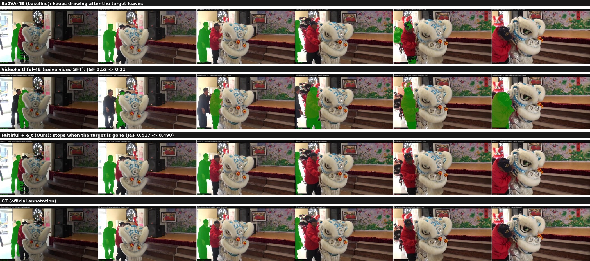
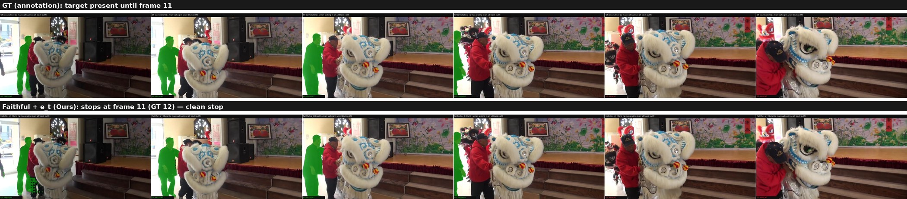
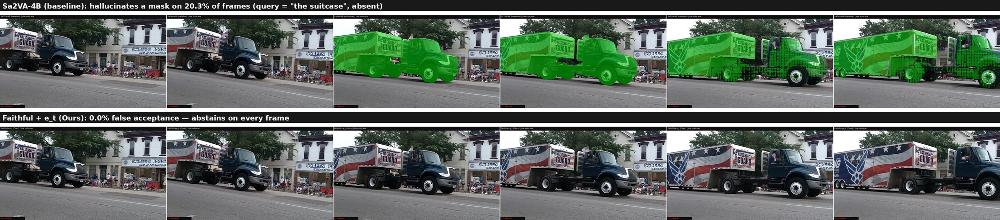
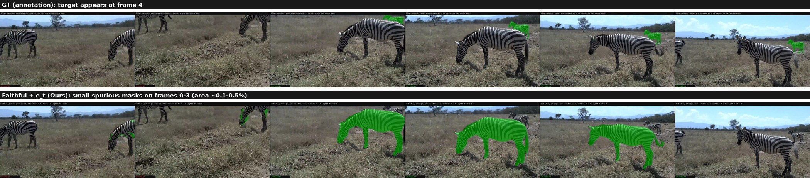
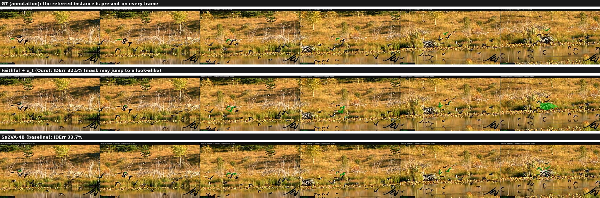

# EvoSeg：统一的图像–视频忠实指代分割（Faithful Image-Video Referring Segmentation）

> **一句话**：把指代分割从「有 query 就无脑出 mask」变成「有证据的选择性预测」——目标不存在 / 消失 / 换成相似实例时，模型应当**拒答或停住**。
>
> **核心主张**：**分割精度 ≠ 忠实性（faithfulness）**。目标存在性是逐帧谓词，我们把它形式化为
> $$e_t=\mathbb{1}\big[\hat M_t\ \text{is faithful to}\ q\big]$$
> —— 不只是"目标在不在"，而是"**当前正在画的 mask 是否仍忠于 query**"。
>
> 目标会议：CVPR 2027。

📎 配套材料：完整数字与协议见 [`evoseg_final_summary.md`](evoseg_final_summary.md)；可视化素材包见 `evo_artifacts/data/EvoSeg_figure_materials.zip`。

---

## 目录

1. [Motivation：为什么"会分割"不等于"知道该不该分割"](#1-motivation)
2. [问题形式化：从 presence 到 faithfulness（双 Track）](#2-问题形式化)
3. [Method：图像拒答 + 外部逐帧忠实度评估器](#3-method)
4. [Benchmark：构造细节与评测协议](#4-benchmark)
5. [实验结果（全部全集数字）](#5-实验结果)
6. [可视化示例：完美成功 / 不完美](#6-可视化示例)
7. [诚实的局限](#7-诚实的局限)
8. [复现信息](#8-复现信息)

---

## 1. Motivation

### 1.1 现有指代分割（RVOS / referring segmentation）默认「目标一定存在」

真实世界的 query 会出问题：

| 真实情形 | 例子 |
|---|---|
| **口误 / 无中生有** | 用户问了场景里根本不存在的物体 |
| **目标消失** | 视频里目标走出画面、被完全遮挡且不再出现 |
| **换人 / 相似目标** | mask 跳到外观相似的另一个实例上 |
| **query 被改写** | 对抗改写后的 query 在场景里不再对应任何目标 |

### 1.2 关键实证（这是整篇论文的起点）

在 **8,905 条 absent 查询**（gRefCOCO no-target + COCO 无目标查询）上：

| 模型 | 幻觉率（应拒答却仍输出 mask） | RefCOCO | gRefCOCO |
|---|---|---|---|
| Sa2VA-4B（基线） | **100%** | 81.95 | 29.8 |
| **Faithful-4B（本文图像级）** | **14.7%** | 82.22 | **69.79** |
| SESAME（外部，有拒答机制） | 33.5% | — | — |
| GSVA-7B（外部，有 `[REJ]`） | 44.6% | — | — |

**结论**：这些模型**正常分割很强（RefCOCO ≈ 82 cIoU），但在目标不存在时 100% 幻觉**——说明"分得准"与"知道该不该分"是**两种独立能力**。

### 1.3 根因：不是模型不行，是训练范式里根本没有"该说没有"这一项

排查训练脚本发现：**no-target 样本在数据构造阶段被直接过滤掉了**，模型从未见过"应当拒答"的监督信号。因此 RL 也补不上（拒答路径从未被探索过）。

### 1.4 但"图像级拒答"并不足够

图像级 abstention（前人 SESAME / GSVA / 本文 Faithful）只能处理**静态 no-target**。视频里真正难的是**逐帧不忠实**：

- 目标在第 12 帧消失，SAM2 的记忆仍把 mask 传下去（残影）；
- 目标一直在，但 mask 跳到了旁边长得像的人身上（identity switch）。

这两类都是**帧级谓词**，静态拒答器看不见。

### 1.5 可视化：三种做法放在同一个 case 上



> 同一个 query（"a man walkng in an all black outfit"），GT 显示目标在第 12 帧离开画面。
> - **Sa2VA-4B（baseline）**：19 帧全程输出 mask —— 目标走了也继续画；
> - **VideoFaithful-4B（naive 做法：直接拿视频 SFT 教拒答）**：拒答"学了一点"，但**正常该分的帧 mask 也变差**，J&F **0.52 → 0.21**（分割能力减半以上）；
> - **Faithful + e_t（本文）**：目标在时正常分割、目标离开后**干净停住**，J&F **0.517 → 0.490**（仅 −2.7pp）。
>
> 一句话：**"直接教拒答"会伤害分割；正确做法是把"该不该保留当前预测"交给一个不碰分割器的外部评估器。**

---

## 2. 问题形式化

### 2.1 e_t 是 faithfulness / acceptance predicate，而不是单纯的 existence

$$
e_t=\mathbb{1}\big[\hat M_t\ \text{is faithful to}\ q\big],\qquad
\text{keep mask if } e_t>\tau,\ \text{else abstain (empty)}.
$$

- **presence 是 referent 的属性**（目标在不在帧里）；
- **faithfulness 是当前预测的属性**（正在画的 mask 是否还对应 query 指的那个实例）。

**为什么必须区分**：identity_swap 中目标**始终在帧里（presence=True）**，但 mask 可能跳到 look-alike 上——此时 presence 视角看到"一切正常"，faithfulness 视角看到"错了"。

### 2.2 双 Track 评测结构

$$
\boxed{\ \text{Faithfulness}=\text{Abstention Faithfulness}+\text{Referential Faithfulness}\ }
$$

| Track | 回答的问题 | 包含类别 | 指标 |
|---|---|---|---|
| **A · Abstention Faithfulness** | **该不该出 mask？** | global absence / counterfactual mismatch / temporal absence | **FA ↓**（False Acceptance）· **FR ↓**（False Rejection）· Risk–Coverage |
| **B · Referential Faithfulness** | **出了 mask，还是不是 query 指的那个实例？** | identity confusion | **IDErr ↓** · **IoU_tar ↑** · **IoU_dist ↓** |

### 2.3 四类失败的概念分层（taxonomy 本身即贡献）

| 类型 | Query 合法？ | 目标当前可分？ | 当前 mask 是正确实例？ |
|---|---:|---:|---:|
| Global absence | ❌ | ❌ | — |
| Counterfactual mismatch | ❌ | ❌ | — |
| Temporal absence | ✅ | 动态变化 | — |
| Identity confusion | ✅ | ✅ | **可能 ❌** |

### 2.4 指标定义（写进 Supplementary）

$$
FA=\frac{\sum_{t:\,a_t=0}\mathbb{1}[\hat M_t\neq\varnothing]}{\sum_t\mathbb{1}[a_t=0]},\qquad
FR=\frac{\sum_{t:\,a_t=1}\mathbb{1}[\hat M_t=\varnothing]}{\sum_t\mathbb{1}[a_t=1]},
\qquad a_t=\mathbb{1}\big[|M_t^{GT}|>0\big]
$$

- `a_t` 只在 **Ref-YT-VOS 官方标注的 evaluation frames** 上定义（本文 52,284 帧）；**未标注的原始帧从不被视为 target-absent**；
- global / counterfactual 只贡献 FA（全帧 `a_t=0`）；
- temporal 同时贡献 FA（absent 帧）与 FR（present 帧）；
- **identity 完全不进入 FA/FR**，单独用 IDErr / IoU_tar / IoU_dist。

---

## 3. Method

### 3.1 总体架构：分割与忠实性**解耦**

```
输入: 视频帧 + query
  │
  ├─ ① 图像级 Faithful（拒答 SFT，分割近无损）
  │      · 静态 no-target → 直接 [REJ]（不画）
  │      · 目标存在     → 输出 [SEG] + SAM2 传播 → 逐帧 mask
  │
  ├─ ② 外部时序忠实度评估器 e_t（≈4.5M 参数，不碰 LLM / 不碰 mask decoder）
  │      输入：vlm_feat（VLM 逐帧感知）
  │            mask_cond（SAM2 在 mask 区域池化的特征）
  │            geom（面积 / 质心）
  │            anchor difference（与 anchor 的显式差分）
  │            lang（文本 embedding）
  │      结构：vlm_proj → BiGRU → 逐帧 logit → e_t
  │      关键设计：**first-present anchor**（第一个目标存在帧）+ 显式锚点差分
  │
  └─ ③ 门控输出：e_t > τ → 保留该帧 mask；否则置空（选择性预测）
```

### 3.2 为什么用「外部头」而不是「让 LLM 学拒答」（本文最重要的方法论发现）

| 做法 | 幻觉 | 分割 J&F |
|---|---|---|
| 图像级拒答 SFT（Faithful，无 zero-mask） | 14.7%（图像）/ Track-A FA 15.5%（视频） | **0.517（近无损）** |
| **视频 faithfulness SFT（教 LLM 在 video 上拒答）** | 低 | **0.213（崩）** |
| **外部 e_t 头（本文）** | Track-A FA **11.1%** | **0.490（仅 −2.7pp）** |

**机制解释**：视频 faithfulness SFT 需要对 absent 帧做 **zero-mask 监督**，这会把 mask decoder 一起改坏——即便模型根本没学会"该停的时刻"，分割能力照样崩（见 §5.7 的受控实验）。所以正确路线是：

> **分割器保持不动；只额外训练一个轻量的、可替换的"该不该保留当前预测"判别器。**

### 3.3 方法演化

| 版本 | 关键改进 | 效果 |
|---|---|---|
| B+ v5 | 用 VLM 全帧感知特征（vlm_feat） | temporal 幻觉大幅下降 |
| **v6** | anchor 修复（第 0 帧 → **首个目标存在帧**）+ 显式锚点差分（mask / vlm） | identity / temporal 进一步下降 |
| **最终** | 基础模型换成 **Faithful**（分割近无损）+ v6 头用 Faithful 特征重训 | **Track-A FA 11.1% @τ=0.8，J&F 0.490** |

### 3.4 效率：为什么这个设计是"轻量"的

- e_t 头仅 **≈4.5M 参数**，纯推理门控；
- **边际成本 +0.061s/case（+1.0%）**（base 6.070s → +v6 6.131s）——瓶颈是分割本身要做的 VLM 全帧前向，评估器几乎免费；
- 帧降采样（stride=2）可再拿到 **2.0× 加速**，Track-A FA 仅 +0.6pp（4B）/ +0.3pp（8B）。

---

## 4. Benchmark

### 4.1 数据来源与帧口径

- 来源：**Ref-YT-VOS valid**（202 视频）的官方实例级标注；
- **帧口径**：`t` 索引的是官方标注的 evaluation frames（每 5 帧一个像素级标注；官方 RVOS benchmark 亦基于这些标注评测），共 **52,284 帧**；
  > *We define frame-wise availability only on officially annotated Ref-YT-VOS evaluation frames; unannotated raw frames are never treated as target-absent.*
  （52284 帧全部来自官方标注帧。）

### 4.2 四类 case 的构造（全部为确定性规则，无需主观标注）

| 类别 | 构造规则 | GT |
|---|---|---|
| **temporal_absence** | 取真实 expression，其 referent 的存在区间为子区间（出现晚 / 消失早）。逐帧 availability 直接由 GT 掩码非空推导（**不设"≤5 帧算存在"之类人为阈值**） | available 帧用官方掩码；unavailable 帧 = 空 |
| **global_absence** | 生成 `the {absent_cat}`，`absent_cat` 从 **17 个类别中随机**选一个视频里没有的类别 | 全帧空 |
| **counterfactual_swap** | 取真实 expression，把其中的**指代类别词替换**成视频里不存在的类别 | 全帧空 |
| **identity_swap** | 视频中存在 **≥2 个同类实例**；query 指向其中一个实例 | 该实例的官方掩码 |

- 规模：**1,986 查询 / 52,284 帧**（global 834 / counterfactual 644 / identity 355 / temporal 153）；
- **train / test 无泄漏**：train 用 Ref-YT-VOS **train** 视频构造，valid 用 **valid** 视频构造，视频不重叠；负样本在两边独立构造；
- **⚠️ 已修复的构造 bug**：早期版本用 `absent_cats[0]` 选负样本类别，导致 global_absence **99%** / counterfactual **58%** 都是 "the elephant"（严重偏置）。已改为 `random.choice(absent_cats)` 并重建（`faithfulness_valid_rebalanced.json`）：
  - global_absence：elephant 99% → **6%**（sheep 7% / airplane 7% / suitcase 6% / giraffe 6% / zebra 6% / …）
  - counterfactual_swap：elephant 58% → **4%**
- **⚠️ 已修复的 GT 口径 bug**：Ref-YT-VOS 的标注目录名是 **expression id**（同一 obj 的多个 expression 共享该 object 的 mask），不是 obj_id。早期可视化误用 obj_id 当目录名会读到**别的 object 的 mask**；现已统一用 exp_id，与 manifest 的 presence 逐帧一致。

### 4.3 评测协议要点

- **J&F**（Ref-YT-VOS valid，202 视频）：官方风格 evaluator，**空预测帧记 J=F=0**、被完全拒绝的 expression **计入分母**（逐表达式 827 个）；
  > 早期版本因"丢弃被拒绝样本"导致 J&F 虚高（0.523-0.530），已废弃；修正后一切数字以本报告为准。
- **Track-A FA/FR**：见 §2.4 公式；
- **Track-B**：IDErr = 𝟙[IoU_dist > IoU_tar]，并报 IoU_tar / IoU_dist。

---

## 5. 实验结果

> 全部为**全集**数字；Track-A/B 口径已统一；J&F 使用修正后的官方式 evaluator。

### 5.1 图像侧 faithfulness（8,905 条 absent 查询）

| 模型 | 幻觉率 | RefCOCO | gRefCOCO |
|---|---|---|---|
| Sa2VA-4B（基线） | **100%** | 81.95 | 29.8 |
| **Faithful-4B** | **14.7%** | 82.22 | **69.79** |
| SESAME（外部） | 33.5% | — | — |
| GSVA-7B（外部） | 44.6% | — | — |

### 5.2 视频 Track-A：Abstention Faithfulness（1,986 查询 / 52,284 帧）

| 指标 | Sa2VA 基线 | Faithful（图像拒答，无 verifier） | **Faithful + e_t（τ=0.8）** |
|---|---|---|---|
| **Overall FA** | **91.2%** | 15.5% | **11.1%** |
| **macro（3 类平均）** | 90.4% | 41.6% | **23.5%** |
| temporal FA | 87.6% | 97.5% | **49.2%**（最 hard） |
| global FA | 87.8% | 4.2% | **3.4%** |
| counterfactual FA | 95.8% | 23.1% | **18.0%** |
| temporal FR | 0.8% | — | 19.6% |

**关键叙事**：图像级拒答能把 FA 从 91.2% 压到 15.5%（global/counterfactual 基本解决），但**对 temporal 几乎无效（97.5%）**；**时序 verifier 正好补上这块**：temporal 97.5% → 49.2%（−48pp），FA 15.5% → 11.1%。

### 5.3 视频 Track-B：Referential Faithfulness（identity，355 case / 8,623 帧）

| 指标 | Sa2VA 基线 | Faithful + e_t（τ=0.8） |
|---|---|---|
| **IDErr ↓** | 33.69% | **32.51%** |
| mean IoU_tar ↑ | 0.494 | 0.445 |
| mean IoU_dist ↓ | 0.733 | **0.650** |

**IDErr vs 阈值（更激进拒答的权衡）**

| τ | IDErr | IoU_tar | IoU_dist | 保留 mask 帧数 |
|---|---|---|---|---|
| 0.80 | 32.5% | 0.445 | 0.650 | 8623 |
| 0.90 | 31.0% | 0.434 | 0.628 | 8150 |
| 0.95 | **28.4%** | 0.409 | 0.588 | 7567 |

**诚实结论**：identity 是**两类模型的共同 hard case**——verifier 在 τ=0.8 只降 1.2pp；提到 τ=0.95 可再降 4.1pp、distractor 重叠 0.73→0.59，但代价是目标重叠 0.49→0.41、少出 ~12% mask。**identity 仍未完全解决**（需实例级重检测 / distractor-aware memory / mask 区域级 VLM 特征）。

### 5.4 分割能力 J&F（Ref-YT-VOS valid 202 视频，官方式 evaluator，逐表达式 827）

| 模型 | J&F | 说明 |
|---|---|---|
| Sa2VA（同协议重跑，基线） | 0.505 | 与官方 0.509 吻合（校验 evaluator 正确） |
| 图像 Faithful（无时序门控） | **0.517** | 基座比 Sa2VA +1.2pp |
| **Faithful + e_t（τ=0.5）** | **0.503** | 仅 −1.4pp |
| **Faithful + e_t（τ=0.8，主操作点）** | **0.490** | −2.7pp |
| 8B Faithful + e_t（τ=0.5） | 0.492 | 跨规模 |
| VideoFaithful（视频 SFT） | 0.213 | 分割崩 |

> **诚实口径**：门控以 **小幅 J&F 代价（−1.4 ~ −2.7pp）** 换取 **巨大的 False Acceptance 下降（91.2% → 11.1%）**。不是"免费午餐"，但代价很小且完全可控，远优于 SFT 的 ~30pp 代价。

### 5.5 阈值 / risk–coverage 分析

| τ | Abstention Error (FA) | False Rejection | macro（3 类） | temporal | global | counterfactual |
|---|---|---|---|---|---|---|
| Sa2VA 基线 | **91.2%** | 0.8% | 90.4% | 87.6% | 87.8% | 95.8% |
| 0（无门控） | 15.49% | 0.60% | 41.60% | 97.5% | 4.2% | 23.1% |
| 0.4 | 12.91% | 3.62% | 29.77% | 65.3% | 3.6% | 20.4% |
| 0.5 | 12.53% | 4.50% | 28.27% | 61.3% | 3.6% | 19.9% |
| 0.6 | 12.07% | 5.57% | 26.87% | 57.8% | 3.5% | 19.3% |
| 0.7 | 11.67% | 7.09% | 25.30% | 53.9% | 3.4% | 18.6% |
| **0.8** | **11.14%** | **8.85%** | **23.53%** | **49.2%** | 3.4% | **18.0%** |

对应 J&F：0.517（无门控）→ 0.503（0.5）→ **0.490（0.8）**。

### 5.6 跨模型规模验证（4B → 8B，scale transfer）

| 指标 | 8B-Faithful 基线 | **8B + e_t（τ=0.5 / 0.8）** |
|---|---|---|
| Abstention FA | **20.31%** | **18.82% / 16.39%** |
| temporal FA | **96.70%** | **76.3% / 54.7%** |
| global / counterfactual FA | 6.33% / 31.95% | 6.1% / 30.4% → 5.45% / 27.33% |
| identity（τ=0.8） | — | **IDErr 31.42% / IoU_tar 0.430 / IoU_dist 0.634** |
| J&F（40 视频子集） | 0.486 | **0.490** |

**结论**：verifier 可跨规模迁移（temporal −42pp、J&F 持平）。**注意**：4B→8B 是同一架构不同规模，我们只 claim **scale transfer**，不 claim "model-agnostic"（后者需要不同架构底座）；8B 基线如实报 20.31%，**不写"91.2% → 17.7%"**。

### 5.7 受控实验：视频 SFT 的"分割–拒答干扰"不是调参没调好

三个控制（每个只改一个因素，其余与 VideoFaithful 配方一致：continue from 图像 Faithful、LoRA、1500 iters、同数据）：

| 控制 | 变量 | 固定 |
|---|---|---|
| c1_negratio | NoTarget 负样本 repeats 4→1 | lr=2e-5, LoRA r=128 |
| c2_lr | lr 2e-5→1e-5 | NoTarget×4, LoRA r=128 |
| c3_lora | LoRA r=128→16 | NoTarget×4, lr=2e-5 |

| 模型 | temporal FA | J&F（40-vid，88 expr） |
|---|---|---|
| 图像 Faithful（对照，无视频 SFT） | — | **0.516** |
| VideoFaithful（原配方 6376 iters） | 76.3% | **0.213** |
| c1_negratio（NoTarget×1） | 96.7% | **0.212** |
| c2_lr（lr=1e-5） | 96.4% | **0.298** |
| c3_lora（r=16） | 96.6% | **0.220** |

**结论**：三个控制在 1500 iters 都**没学会时序拒答**（temporal 96.4-96.7%，≈ 基线水平），但 **J&F 全部崩到 0.21-0.30**——说明损伤来自 **absent 帧的 zero-mask 监督本身**，与"拒答学没学会"、与 LR / LoRA 容量 / 负样本比例都无关（*persistent segmentation–rejection interference*）。

### 5.8 轻量化：帧降采样（stride）的效率–忠实度权衡

| stride | 平均帧数 | Track-A FA | temporal FA | 每 case 延迟 | 加速 |
|---|---|---|---|---|---|
| 1（全帧） | 26.3 | **11.1%** | 49.2% | 6.16s | 1.0× |
| 2 | 13.3 | 11.7%（+0.6） | 54.1% | **3.13s** | **2.0×** |
| 3 | 9.0 | 12.7%（+1.6） | 54.6% | **2.23s** | **2.8×** |

8B 同款：stride1 16.39% → stride2 16.68%（+0.3）→ stride3 17.00%（+0.6）——**规模越大越稳**。
**verifier 边际成本**：base 6.070s → +e_t 6.131s，**+0.061s（+1.0%）**。

### 5.9 外部泛化

| 数据集 | Sa2VA 基线 | 本文 |
|---|---|---|
| HalluSegBench（图像反事实） | 幻觉 100% | 幻觉 **62-64%**（即拒答 36-38%） |
| MeViSv2（视频 no-target） | 幻觉 99.7% | 幻觉 **51.8-53.3%**（即拒答 46.7-48.2%） |

---

## 6. 可视化示例

> 图例：每张图是**逐帧横向拼接**；每帧下方的 `GT: PRESENT / ABSENT` 由**官方标注掩码**推出；绿色叠加 = 模型该帧输出的 mask。

### 6.1 ✅ 完美成功 1：目标消失后干净停住（temporal absence）



GT 显示目标在第 12 帧离开画面；我们的模型在它消失后**不再输出 mask**（Track-A temporal FA 从 97.5% 降到 49.2%）。

### 6.2 ✅ 完美成功 2：query 目标根本不存在（global absence）



query = "the suitcase"，视频里没有任何行李箱。**Sa2VA 在 20.3% 的帧上仍画出 mask（纯幻觉）**，我们的模型 **0.0% false acceptance —— 全帧 abstain**。

### 6.3 ⚠️ 不完美 1：目标"还没出现"时有小残影（temporal appear-late）



GT 显示目标在第 4 帧才出现；我们的模型在前 4 帧仍输出**极小的伪 mask**（area 约 0.1%–0.5%，视觉上近乎空），verifier 对"尚未出现"的判据弱于"已经消失"。这是已知的、方向明确的失败模式。

### 6.4 ⚠️ 不完美 2：identity confusion 仍未解决（Track B）



目标始终存在，但 mask 可能跳到相似实例上：**IDErr 32.5%（我们）vs 33.7%（Sa2VA）**，IoU_dist（0.65）仍高于 IoU_tar（0.45）。提到 τ=0.95 可把 IDErr 降到 28.4%，但会牺牲目标重叠。**如实报告为 future work。**

---

## 7. 诚实的局限

1. **identity confusion 未解决**：IDErr 仅从 33.7% → 32.5%，需要实例级机制（重检测 / distractor-aware memory / mask 区域级 VLM 特征）而非只调 head——我们验证了加 anchor-cosine 特征的 v7 头**没有改善**（IDErr 32.97%），说明瓶颈在特征层面；
2. **temporal 的"尚未出现"边界弱于"已经消失"**（见 §6.3）；
3. **门控仍有代价**：τ=0.8 时 J&F −2.7pp、temporal FR 19.6%；
4. **8B 只是同架构的 scale transfer**，不构成 model-agnostic 证据（需要另一套架构底座才能 claim）；
5. **J&F 修正过**：早期版本因 evaluator 丢弃被拒绝样本而虚高（0.523–0.530），现已全部改为修正后的官方式口径（0.490–0.517）。

---

## 8. 复现信息

### 8.1 关键模型检查点

| 名称 | 路径 |
|---|---|
| 图像 Faithful-4B（基座） | `evo_artifacts/models/EvoSeg-Qwen3-VL-4B-Faithful` |
| 最终模型（Faithful + e_t，τ=0.8） | 同上 + `temporal_existence_head.pt` |
| VideoFaithful（naive SFT 对照） | `evo_artifacts/models/EvoSeg-Qwen3-VL-4B-VideoFaithful` |
| 8B（跨规模验证） | `evo_artifacts/models/EvoSeg-Qwen3-VL-8B-Faithful` |
| Sa2VA-4B（基线） | `evo_artifacts/models/Sa2VA-Qwen3-VL-4B` |

### 8.2 关键脚本

| 用途 | 脚本 |
|---|---|
| 构造 benchmark（train/valid） | `projects/evoseg/tools/build_video_faithfulness_manifest.py` |
| Track-A/B 评测 | `projects/evoseg/eval/eval_video_faithfulness.py` |
| Ref-YT-VOS J&F | `projects/evoseg/eval/infer_ryvos.py` + `eval_ryvos_jf.py` |
| 外部 e_t 头训练 | `projects/evoseg/tools/train_vlm_fidelity_head_v6.py` |
| 视频 SFT 受控实验 | `projects/evoseg/tools/train_temporal_refusal_sft.py` |
| 对比视频/图生成 | `projects/evoseg/eval/make_model_comparison_videos.py` |

### 8.3 数据与素材

| 内容 | 位置 |
|---|---|
| faithfulness benchmark（valid/train） | `evo_artifacts/datasets/ref_youtube_vos/faithfulness_{valid,train}.json` |
| rebalanced valid manifest | `/tmp/faithfulness_valid_rebalanced.json`（构造脚本可重建） |
| 可视化素材包（视频 + 逐帧拼接图 + presence json） | `evo_artifacts/data/EvoSeg_figure_materials.zip` |
| 完整数字与协议 | `docs/evoseg_final_summary.md` |

---

## 附：一页速览

| 维度 | 结果 |
|---|---|
| 图像 absent 幻觉 | Sa2VA 100% → 本文 **14.7%**（SESAME 33.5% / GSVA 44.6%） |
| 视频 Track-A FA | Sa2VA 91.2% → Faithful 15.5% → **+e_t 11.1%** |
| temporal FA | 97.5% → **49.2%**（−48pp） |
| Track-B identity | IDErr 33.7% → **32.5%**（τ=0.95 时 28.4%，仍为 open problem） |
| 分割 J&F | **0.517 → 0.490**（−2.7pp，官方 0.509） |
| naive 视频 SFT 对照 | J&F **0.52 → 0.21**（三个受控实验一致复现） |
| 效率 | e_t 头 4.5M、边际 **+1.0%**；stride=2 可 **2× 加速**（FA +0.6pp） |
| 跨规模 | 8B：temporal 96.7% → 54.7%，J&F 持平 |
